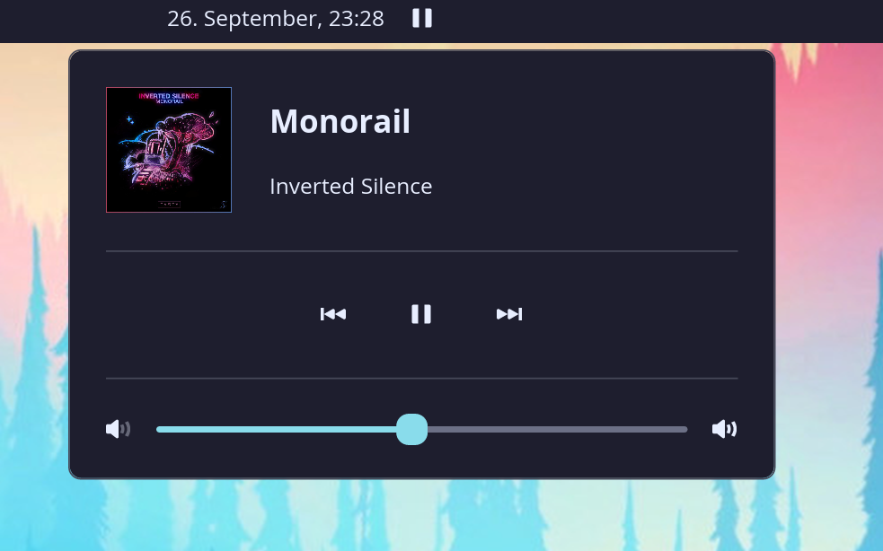

# COSMIC Music Player Applet

A modern music player applet for the COSMIC desktop environment with MPRIS integration, providing seamless control of your music directly from the panel.

## Screenshots


The applet displays as a music icon in the COSMIC panel. Click it to open the control popup featuring:
- Album artwork (left side)
- Song title and artist information (right side)
- Media control buttons (previous, play/pause, next)
- Volume control slider

## Features

### 🎵 **Music Control**
- **Play/Pause**: Toggle playback with a single click
- **Track Navigation**: Skip to previous/next tracks
- **Real-time Status**: Shows current playback state (playing/paused/stopped)

### 🎨 **Visual Display**
- **Song Information**: Displays current song title and artist
- **Album Artwork**: Shows album covers from MPRIS-compatible players
- **Responsive UI**: Clean, modern interface that fits seamlessly in COSMIC

### 🔊 **Volume Control**
- **Precision Slider**: Fine-grained volume control (1% increments)
- **Visual Indicators**: Volume icons for easy reference

### ⌨️ **Convenient Controls**
- **Mouse Scroll**: Scroll up/down over the applet icon for next/previous track
- **Middle Click**: Middle-click the applet icon to play/pause
- **Panel Integration**: Compact icon in the panel, detailed controls in popup

### 🔌 **MPRIS Compatibility**
Works with any MPRIS-compatible music player, including:
- Spotify
- VLC Media Player
- Rhythmbox
- Clementine
- MPD clients
- And many more!

## Installation

### Arch Linux (AUR)

The applet is available as an **AUR package**:

```bash
paru -S cosmic-applet-music-player-git
```

or with yay:

```bash
yay -S cosmic-applet-music-player-git
```

This will build and install the latest development version directly from Git.

### Build from Source (Other Distributions)

1. **Clone the repository**:
   ```bash
   git clone https://github.com/Ebbo/cosmic-applet-music-player.git
   cd cosmic-applet-music-player
   ```

2. **Build the applet**:
   ```bash
   just build-release
   ```

3. **Install system-wide**:
   ```bash
   sudo just install
   ```

### Prerequisites

- Rust 1.80+
- COSMIC desktop environment
- Just build tool
- Git (for cloning)

## Development

For development and testing:

```bash
# Build debug version
just build-debug

# Run with debug logging
just run

# Clean build artifacts
just clean
```

## Usage

1. **Launch**: The applet will appear in your COSMIC panel after installation
2. **Basic Control**: Click the music icon to open the control popup
3. **Quick Actions**:
   - Scroll up/down over the icon for track navigation
   - Middle-click for play/pause
4. **Volume**: Use the slider in the popup for precise volume control

## Configuration

The applet automatically detects and connects to MPRIS-compatible music players. No additional configuration is required.

## Supported Players

Any application that implements the MPRIS D-Bus interface is supported, including:

- **Streaming Services**: Spotify, YouTube Music (browser), etc.
- **Media Players**: VLC, MPV, Clementine, Rhythmbox
- **Music Daemons**: MPD with compatible clients
- **Browser Players**: Firefox, Chrome with media playing

## Technical Details

- **Framework**: Built with libcosmic (COSMIC's UI toolkit)
- **Language**: Rust
- **Integration**: MPRIS D-Bus interface
- **Performance**: Lightweight, updates every 500ms
- **Memory**: Minimal footprint, efficient image caching

## License

This project is licensed under the GPL-3.0 License - see the LICENSE file for details.

## Contributing

Contributions are welcome! Please feel free to submit pull requests or open issues for bugs and feature requests.

## Troubleshooting

### Applet not showing music info
- Ensure your music player supports MPRIS
- Check that the player is actually playing music
- Restart the music player and the applet

### No album artwork
- Album artwork depends on the music player providing image URLs
- Some players may not provide artwork through MPRIS
- Local files may not have embedded artwork

### Mouse shortcuts not working
- Ensure you're hovering directly over the applet icon
- Check that no other application is intercepting mouse events

## Building Requirements

The following system packages are required for building:

- `libdbus-1-dev` (for MPRIS communication)
- `pkg-config` (for dependency detection)
- `libssl-dev` (for HTTPS requests)

Install on Ubuntu/Debian:
```bash
sudo apt install libdbus-1-dev pkg-config libssl-dev
```

Install on Fedora:
```bash
sudo dnf install dbus-devel pkgconfig openssl-devel
```
